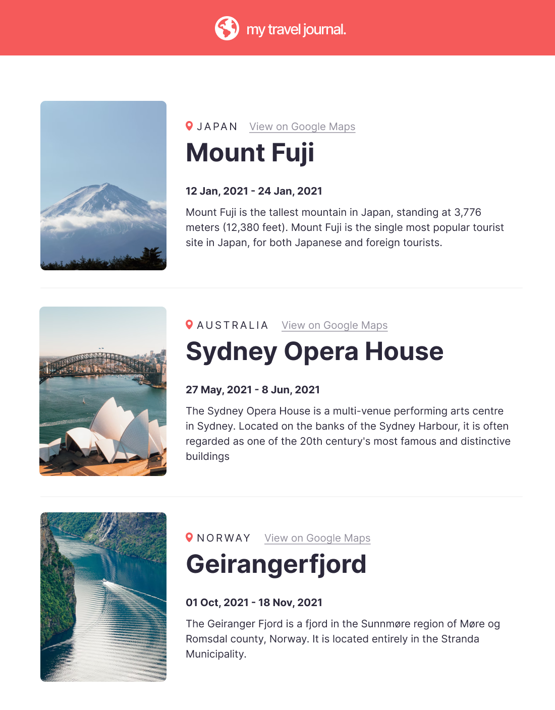

## 🎯 Desafio:
Com base em um layout, foi proposto a criação de uma página de login responsiva.
 
### Layout disponibilizado:

<a href="https://www.figma.com/file/uZc7OEejh8ed6pwWQreJPd/Travel-Journal-(Copy)?node-id=2%3A2">Clique aqui para acessar o layout</a> 
 

## 🚀 Resultado: 

<a href="https://campin-login-page.vercel.app">Clique aqui para acessar o site</a> 

## ⚒️ Tecnologias utilizadas:
* ReactJS
* HTML
* SASS